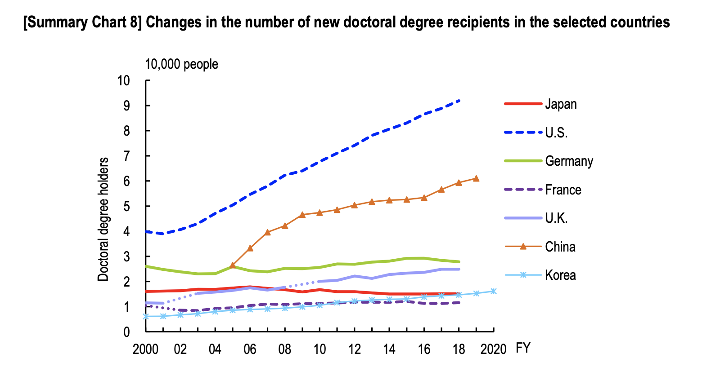

In Japan people often say that its PhD system is screwed, and unfortunately I have to agree with it.
At the same time, there are few Japanese pursuing a PhD outside of Japan. I couldn't find any data on it, but
I guess that they are less than 10 (even 5) % of those pursuing PhD in Japan.
For instance, I was the only person, among math master students (around 40 students) at my previous university (Kyushu university) in 2020, who
left Japan for a PhD.

As a rare Japanese who is pursuing a math PhD in Germany, here I want to compare the PhD systems (math) in these two countries.
If you want to share the PhD system in your country, I appreciate it if you leave a comment below.

## Funding
In Japan, most PhD students try to get funding from [Japanese Society for the Promotion of Science](https://www.jsps.go.jp/english/index.html) (日本学術支援機構).
For this there are two applications: DC1 and DC2. Let me explain DC1 first.

After the first-year master studies, students who want to pursue a PhD start to write an application form
of DC1. Besides basic information, they have to write (1) research proposal (3 pages), (2) self-assessment of your ability to complete the proposal (2 pages) and (3) pictures of aimed researchers (1 page).
It is written in Japanese but [here](https://www.jsps.go.jp/j-pd/data/boshu/03_dc_naiyo.pdf) you can see
the application form.
To some degree, you have to write a proposal for any PhD application, but DC1 seems too demanding,
especially for math students who just finished the first-year master study.
I spent two months of writing the DC1 proposal and I always felt 'what the hell am I supposed to write?'.

The acceptance rate of DC1 is scary: **20 %**. This sounds even scarier if you take into consideration
the number of PhD students in Japan, which I will discuss later. How come a developed country like Japan
funds only 20 percent of PhD students? By the way, I failed DC1.

**In Germany, I have never seen PhD students who are not funded**. As for math PhD in Berlin,
there are at least three major ways to get funding. The first is to receive scholarship from the Berlin Mathematical
School. The second is to become a member of a research project. The disadvantage is that you are a part of a research
project and hence you cannot always do whatever research you want to do.
The third, which applies to me, is to be employed by a university through some project. In some cases you have teaching duties.

Only 20% of PhD students in Japan are funded through DC1. Many people say that whether you can win DC1 is a
matter of politics and that failing DC1 does not reflect on your ability so much. Indeed, there are some
researchers who now have a position in a university but could not get DC1 or DC2. Yet, failing DC1 has a huge
adverse effect on your confidence.

If they fail DC1, they must go through the first year of the PhD without funding. They can earn by teaching assistance, but in most cases this is by far insufficient for living. Many of them end up in doing part-time jobs.
However, *they could get funding from the second year, if they win DC2*. The format of DC2 is exactly the same
as DC1, and the acceptance rate is almost the same as that of DC1.

In addition to the acceptance rate, another scary aspect is how much money winners of DC1 or DC2 receive.
**They receive around 150000 JPY (≈ 1040€, on Sep 13, 2022) per month after tax** for living, with *maximum* 1500000 JPY (≈ 10400€) per year for
research (e.g. traveling, buying laptop and etc).
In Berlin, math PhD students receive at least 1500€ after tax per month for living, and their travels are usually covered by
the funding of their supervisors. I receive around 2000€ without teaching and 2700€ with teaching.
I received a mac laptop and travel costs from my supervisor's funding.

## Number and diversity of PhD students
You can find some statistics on science in Japan from [this official document](https://www.nistep.go.jp/wp/wp-content/uploads/NISTEP-RM311-SummaryE.pdf).
A more detailed information are available [here](https://www.nistep.go.jp/research/science-and-technology-indicators-and-scientometrics/indicators) but only in Japanese.

---continued.
